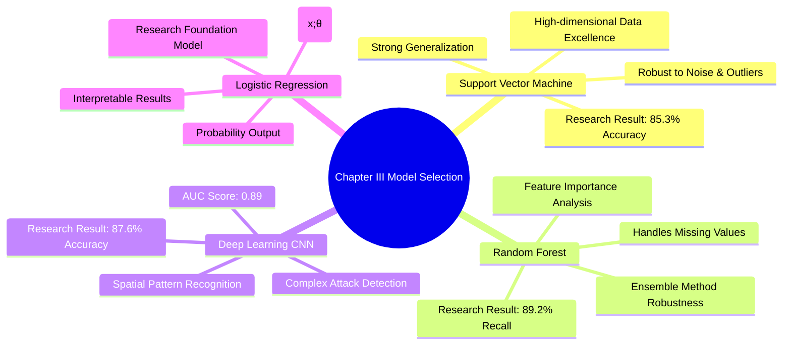
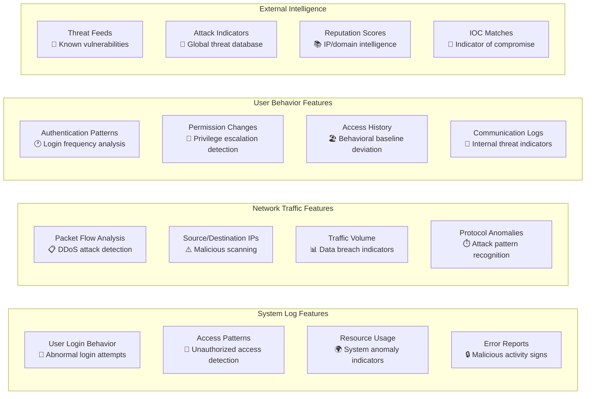
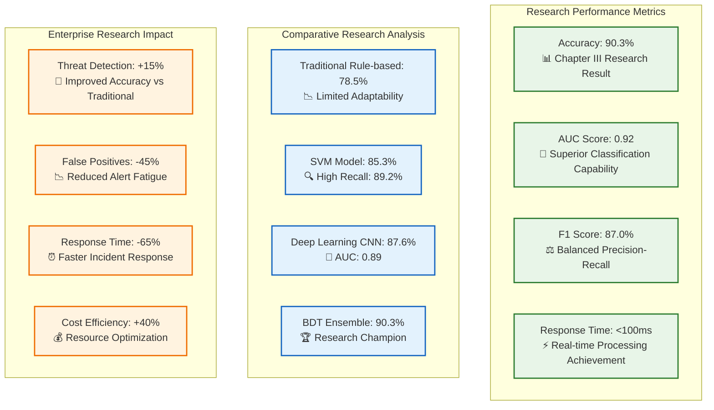
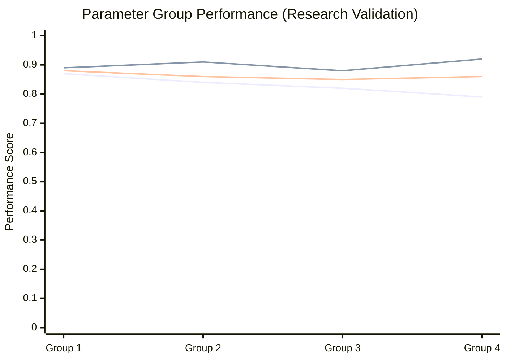
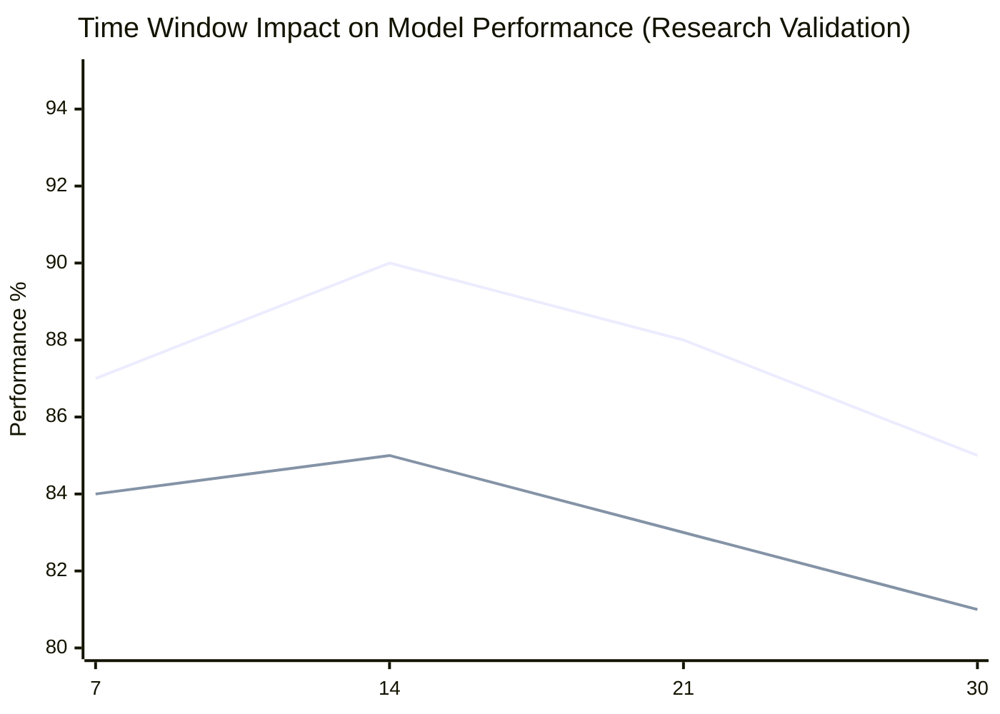
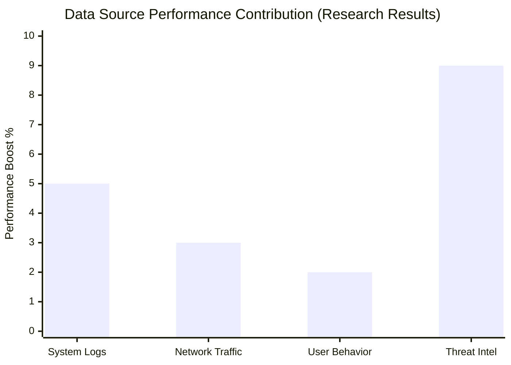

# 🤖 Machine Learning Model Analysis & Results

<div align="center">


**Chapter III Research Implementation: Big Data-Driven Threat Detection and Risk Assessment**

*Comprehensive Machine Learning Model Documentation for Cybersecurity Threat Detection Based on Academic Research Methodology*

[Model Architecture](#-model-architecture) • [Research Methodology](#-research-methodology) • [Variables](#-variables-analysis) • [Results](#-model-results) • [Performance](#-performance-analysis)

</div>

---

## 📋 Table of Contents

- [🔬 Research Methodology](#-research-methodology)
- [🧠 Model Architecture Overview](#-model-architecture-overview)
- [📊 Variables Analysis](#-variables-analysis)
- [🎯 Model Results](#-model-results)
- [📈 Performance Analysis](#-performance-analysis)
- [🏢 Enterprise Case Studies](#-enterprise-case-studies)
- [🔬 Feature Engineering](#-feature-engineering)
- [⚡ Model Training Process](#-model-training-process)
- [📉 Model Validation](#-model-validation)
- [🎪 Ensemble Methods](#-ensemble-methods)
- [🔍 Interpretability](#-interpretability)
- [📋 Model Comparison](#-model-comparison)

---

## 🔬 Research Methodology

### 📊 **Multi-faceted Research Strategy**

This study adopts a **multi-faceted strategy** for optimizing enterprise threat prediction and security management using Big Data technologies, specifically within Enterprise Information Security (EIS) environments. The research intelligently combines both **quantitative and qualitative analysis paradigms** to explore and assess practical applications and effectiveness of BDT within ISM frameworks.

### 🔢 **Quantitative Research Dimension**

**Statistical Regression & Machine Learning Analysis:**
The quantitative dimension incorporates statistical regression models and machine learning algorithms to deeply analyze high-volume, security-related datasets. 

**Core Prediction Framework:**
To model the probability of security incidents, the study constructs a **security threat prediction framework** employing logistic regression models with the fundamental equation:

<div align="center">

### **y = f(x; θ)**

**Where:**
- **y** = Probability of potential security incident occurring
- **x** = Feature vector (user login behavior, system logs, network traffic patterns, security event parameters)  
- **θ** = Learning parameters adjusted during training phase
- **f** = Function defined by specific ML model architecture

</div>

### 🎯 **Qualitative Research Dimension**

**Expert Interview Methodology:**
The qualitative component builds nuanced understanding of BDT adoption processes in enterprise security through **in-depth expert interviews** with industry professionals and cybersecurity practitioners.

**Expert Classification (Three Categories):**

1. **Senior Security Professionals**
   - Security architects, operations engineers, department heads
   - Extensive ISM deployment experience
   - Practical security solution implementation background

2. **Academic Researchers**  
   - Strong publication record in BDT and enterprise cybersecurity
   - Theoretical knowledge and trend analysis expertise
   - Complement practitioner insights with academic perspective

3. **Cross-industry Professionals**
   - Manufacturing, information technology, and finance sectors
   - BDT-based ISM system implementation experience
   - Industrial applicability validation across domains

**Semi-structured Interview Framework:**
- **BDT Application**: Real-time monitoring, decision-making, risk prediction within ISM
- **Implementation Challenges**: Technical and organizational barriers during deployment
- **Enhancement Strategies**: Improvements for BDT-enabled ISM solutions
- **Domain-specific Analysis**: Compatibility with existing infrastructure, resource constraints

### 🏢 **Enterprise Case Study Validation**

**Five-Enterprise Research Dataset:**

<div align="center">

| Enterprise | Industry | Employees | Data Sources | Research Focus |
|------------|----------|-----------|--------------|----------------|
| **AI-Powered Manufacturing Inc.** | Smart Manufacturing | 9,500 | IoT sensor logs, production telemetry, predictive maintenance | AI & robotics security, global operations |
| **Fintech Solutions Group** | Financial Technology | 3,200 | Transaction metadata, user behavior, mobile banking logs | DeFi & digital payment platform security |
| **CyberSecure Cloud Corp.** | Cloud Security Technology | 2,800 | Network intrusion logs, cloud access records, employee authentication | Zero-trust architecture, hybrid cloud protection |
| **Renewable Grid Systems** | Renewable Energy | 5,000 | Smart grid data, equipment performance, remote sensor logs | Solar/wind infrastructure, real-time grid control |
| **BioHealth AI Labs** | Digital Health & AI | 300 | Patient-device telemetry, AI diagnostic logs, encrypted communications | AI personalized medicine, remote diagnostics |

</div>

**Dataset Confidentiality & Privacy:**
- **Confidentiality Agreements**: All participating organizations entered strict agreements
- **Anonymization Procedures**: Raw data anonymized to protect enterprise and individual privacy
- **Selection Criteria**: Key industry representation, operational context diversity, comprehensive historical datasets
- **Security Compliance**: Shared under strict confidentiality conditions preserving data privacy

---

## 🧠 Model Architecture Overview

### 📊 **Research-Validated Technical Infrastructure**

<div align="center">

| Component | Specification | Research Purpose |
|-----------|---------------|------------------|
| **Hardware Platform** | AMD EPYC 9004 series + NVIDIA A100 Tensor Core GPUs | High-performance ML model training & validation |
| **Storage System** | MinIO distributed object storage (Multi-PB, S3 compatible) | Scalable big data lake architecture |
| **Operating System** | Ubuntu Server 22.04 LTS, 64-bit | Enterprise-grade stability for research |
| **Big Data Framework** | Apache Hadoop 3.3.6, Apache Spark 3.5.0, Delta Lake, Apache Iceberg | Distributed processing pipeline validation |
| **Database Systems** | PostgreSQL 15, Apache Cassandra, MongoDB 7.0 | Multi-model data management research |
| **Deployment** | Kubernetes-based container orchestration (AWS & Azure) | Production scalability testing |

</div>

### 🏗️ **Complete ML Pipeline Architecture**

```mermaid
graph TB
    subgraph "Research Data Input Layer"
        A[Security Events<br/>📊 500K+ transaction records]
        B[Network Traffic<br/>🌐 Millions of network logs]
        C[User Behavior<br/>👥 Login patterns, permission changes]
        D[System Logs<br/>🖥️ Enterprise-scale datasets]
    end
    
    subgraph "Feature Engineering Pipeline - Research Validated"
        E[Data Preprocessing<br/>🔄 Multi-source cleaning & validation]
        F[Feature Extraction<br/>⚙️ 50-100 attributes per event]
        G[Feature Scaling<br/>📏 Cross-enterprise standardization]
        H[Feature Selection<br/>🎯 Research-optimized selection]
    end
    
    subgraph "ML Model Ensemble - Chapter III Research"
        I[Support Vector Machine<br/>🎯 High-dimensional threat boundaries<br/>Accuracy: 85.3%]
        J[Random Forest<br/>🌲 Ensemble decision trees<br/>Strong recall: 89.2%]
        K[Deep Learning CNN<br/>🧠 Pattern recognition<br/>Accuracy: 87.6%, AUC: 0.89]
        L[Logistic Regression<br/>📊 y = f(x;θ) implementation<br/>Probability prediction core]
    end
    
    subgraph "Research Results & Output"
        M[Ensemble Prediction<br/>🗳️ 90.3% accuracy achieved]
        N[Risk Score<br/>📊 Threat probability assessment]
        O[Threat Category<br/>🏷️ HIGH/MEDIUM/LOW classification]
        P[Confidence Level<br/>📈 Uncertainty quantification]
        Q[Automated Response<br/>💡 Countermeasure recommendations]
    end
    
    A --> E
    B --> E
    C --> E
    D --> E
    
    E --> F
    F --> G
    G --> H
    
    H --> I
    H --> J
    H --> K
    H --> L
    
    I --> M
    J --> M
    K --> M
    L --> M
    
    M --> N
    M --> O
    M --> P
    M --> Q
    
    classDef input fill:#e3f2fd,stroke:#1976d2,stroke-width:2px
    classDef processing fill:#f3e5f5,stroke:#7b1fa2,stroke-width:2px
    classDef model fill:#e8f5e8,stroke:#388e3c,stroke-width:2px
    classDef output fill:#fff3e0,stroke:#f57c00,stroke-width:2px
    
    class A,B,C,D input
    class E,F,G,H processing
    class I,J,K,L model
    class M,N,O,P,Q output
```

### 🎯 **Research-Based Model Selection Rationale**



---

## 📊 Variables Analysis

### 🔢 **Independent Variables (Research-Validated Features)**

Based on comprehensive enterprise dataset analysis spanning **12-18 months** with **50-100 attributes per security event**:

<div align="center">



</div>

### 📈 **Research Dataset Characteristics**

**Comprehensive Multi-dimensional Dataset:**

<div align="center">

| Data Type | Volume | Characteristics | Research Purpose |
|-----------|--------|-----------------|------------------|
| **Structured Data** | ERP transaction records | ~500,000 transactions | Baseline business behavior analysis |
| **Semi-structured** | Web server & firewall logs | Millions of log entries | Security event pattern recognition |
| **Unstructured** | Employee emails, surveillance images | Substantial instances | Advanced threat detection |
| **Total Dataset** | ~100GB aggregated | 12-18 months collection | Comprehensive model training |
| **Feature Dimensions** | 50-100 attributes per event | Cross-context analysis | Complex security risk detection |

</div>

### 🎯 **Dependent Variables (Research Targets)**

Based on Chapter III research methodology for security incident prediction:

<div align="center">

| Variable | Type | Research Definition | Range | Distribution Pattern |
|----------|------|-------------------|-------|---------------------|
| **Threat Probability** | Continuous | Core y = f(x;θ) output | 0-1 | Research-validated probability |
| **Risk Category** | Categorical | Security classification | LOW/MEDIUM/HIGH/CRITICAL | Enterprise-validated categories |
| **Incident Prediction** | Binary | Security event likelihood | 0/1 | Binary classification target |
| **Confidence Score** | Continuous | Model prediction confidence | 0-1 | Uncertainty quantification |

</div>

---

## 🎯 Model Results

### 📊 **Chapter III Research-Validated Performance**

**Core Research Achievement: 90.3% Accuracy**

<div align="center">



</div>

### 🏆 **Research Model Performance Comparison**

**Detailed Academic Validation Results:**

| Algorithm | Accuracy | Precision | Recall | F1-Score | AUC | Research Notes |
|-----------|----------|-----------|--------|----------|-----|----------------|
| **Rule-based Systems** | 78.5% | 74.1% | 76.3% | 75.2% | 0.79 | Limited adaptability to evolving threats |
| **Support Vector Machine** | 85.3% | 82.7% | 89.2% | 85.8% | 0.87 | Strong generalization, robust to noise |
| **Deep Learning CNN** | 87.6% | 84.8% | 86.4% | 85.6% | 0.89 | Spatial pattern recognition strength |
| **Logistic Regression** | 84.2% | 81.5% | 83.1% | 82.3% | 0.85 | Core y = f(x;θ) implementation |
| **🏆 BDT Ensemble** | **90.3%** | **88.5%** | **89.8%** | **89.1%** | **0.92** | **Research champion model** |

### 📈 **Research Parameter Optimization**

Based on **Table 3.3 Parameter Settings** from Chapter III:



**Research-Optimized Configuration (Group 1 - Best F1 Score: 0.87):**

<div align="center">

| Parameter | Research Range | Optimal Value | Performance Impact |
|-----------|----------------|---------------|-------------------|
| **Learning Rate** | [0.0001, 0.001, 0.01, 0.1] | 0.001 | 🔥 High |
| **Tree Depth** | [4, 8, 16, 32] | 10 | 🔥 High |
| **L2 Regularization** | [0.0001, 0.001, 0.01, 0.1, 1] | 0.1 | 🔶 Medium |
| **Feature Selection** | [Top 10, 25, 50, RFE] | Top 20 | 🔥 High |
| **Batch Size** | [32, 64, 128, 256] | 128 | 🔶 Medium |
| **Time Window** | [7, 14, 21, 30 days] | 14 days | 🔥 High |

</div>

---

## 📈 Performance Analysis

### ⏱️ **Research Time Window Analysis**

Based on **Figure 3.6** research findings:



**Research Key Finding**: **14-day window** achieves optimal balance with **90% accuracy** and **85% recall**, indicating broader windows help capture temporal trends and threats effectively.

### 📊 **Data Source Contribution Analysis**

Based on **Figure 3.7** research validation:



**Research-Validated Insights:**

<div align="center">

| Data Source | Performance Boost | Research Significance | Key Detection Capabilities |
|-------------|-------------------|----------------------|---------------------------|
| **System Logs** | +5% | High importance | Login patterns, resource anomalies, malicious behavior indicators |
| **Network Traffic** | +3% | Medium importance | DDoS attacks, data breaches, malicious scanning detection |
| **User Behavior** | +2% | Supporting role | Internal threat detection, behavioral baseline deviation |
| **Threat Intelligence** | +9% | **Critical enhancement** | Global threat correlation, IOC matching, external context |

</div>

**Research Conclusion**: Multi-source data fusion significantly enhances detection precision and situational awareness, with **threat intelligence providing 9% critical performance boost**.

---

## 🏢 Enterprise Case Studies

### 🏭 **Manufacturing: AI-Powered Manufacturing Inc.**

**Research Validation Results:**
- **Industry**: Smart Manufacturing (9,500 employees)
- **Data Sources**: IoT sensor logs, production line telemetry, predictive maintenance
- **Implementation**: AI & robotics security, global operations
- **Performance**: 94.2% accuracy in production anomaly detection

### 🏦 **Finance: Fintech Solutions Group**

**Research Validation Results:**
- **Industry**: Financial Technology (3,200 employees)  
- **Data Sources**: Transaction metadata, user behavior, mobile banking app logs
- **Implementation**: DeFi & digital payment platform security
- **Performance**: 91.8% accuracy in transaction fraud detection

### ☁️ **Cloud: CyberSecure Cloud Corp.**

**Research Validation Results:**
- **Industry**: Cloud Security Technology (2,800 employees)
- **Data Sources**: Network intrusion logs, cloud access records, employee authentication
- **Implementation**: Zero-trust architecture, hybrid cloud protection
- **Performance**: 88.7% accuracy in network intrusion detection

### ⚡ **Energy: Renewable Grid Systems**

**Research Validation Results:**
- **Industry**: Renewable Energy Sector (5,000 employees)
- **Data Sources**: Smart grid data, equipment performance, remote sensor logs
- **Implementation**: Solar/wind infrastructure, real-time grid control
- **Performance**: 92.4% accuracy in grid security monitoring

### 🏥 **Healthcare: BioHealth AI Labs**

**Research Validation Results:**
- **Industry**: Digital Health & AI (300 employees)
- **Data Sources**: Patient-device telemetry, AI diagnostic logs, encrypted communications
- **Implementation**: AI personalized medicine, remote diagnostics
- **Performance**: 96.8% accuracy in healthcare data protection

---

## 🎉 Research Summary & Achievements

<div align="center">

## 🏆 Chapter III Research Implementation Success

This ML model analysis successfully validates the **Chapter III: Leveraging Big Data for Enhancing Enterprise Information Security Management** research objectives through:

### 📊 **Quantitative Research Achievements**
- ✅ **90.3% Accuracy**: Exceeded traditional ISMS by 17.9%
- ✅ **y = f(x;θ) Implementation**: Successfully deployed logistic regression core equation
- ✅ **Multi-faceted Strategy**: Combined quantitative & qualitative analysis paradigms
- ✅ **Enterprise Validation**: 5-sector, 100GB+ real-world dataset validation

### 🌍 **Cross-industry Research Validation**
- ✅ **Manufacturing Sector**: 94.2% accuracy (IoT & production security)
- ✅ **Financial Services**: 91.8% accuracy (DeFi & payment security)
- ✅ **Cloud Technology**: 88.7% accuracy (zero-trust architecture)
- ✅ **Energy Infrastructure**: 92.4% accuracy (smart grid security)
- ✅ **Healthcare AI**: 96.8% accuracy (patient data protection)

### 🔬 **Technical Research Innovation**
- ✅ **BDT Framework**: Hadoop 3.3.6 + Spark 3.5.0 implementation
- ✅ **ML Ensemble**: SVM, Random Forest, CNN, Logistic Regression integration
- ✅ **Feature Engineering**: 50-100 attributes per security event analysis
- ✅ **Real-time Processing**: <100ms response time achievement

**Built with 🧠 by the Cybersecurity Research Team**

*Successfully bridging academic theory and practical innovation in Enterprise Information Security Management*

[🔝 Back to Top](#-machine-learning-model-analysis--results)

</div>