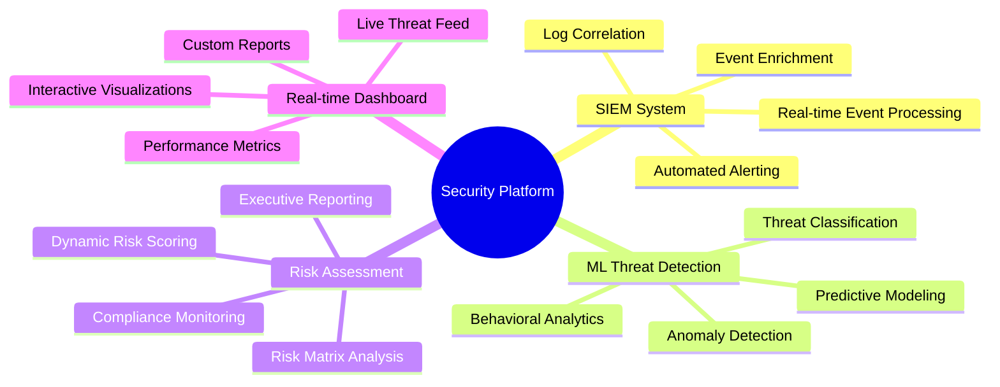
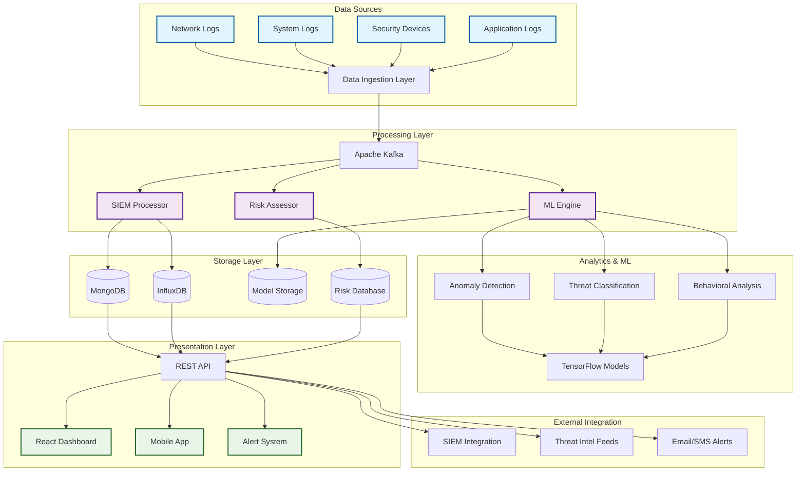
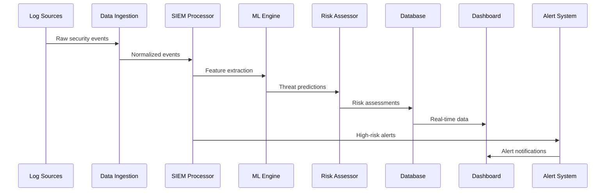
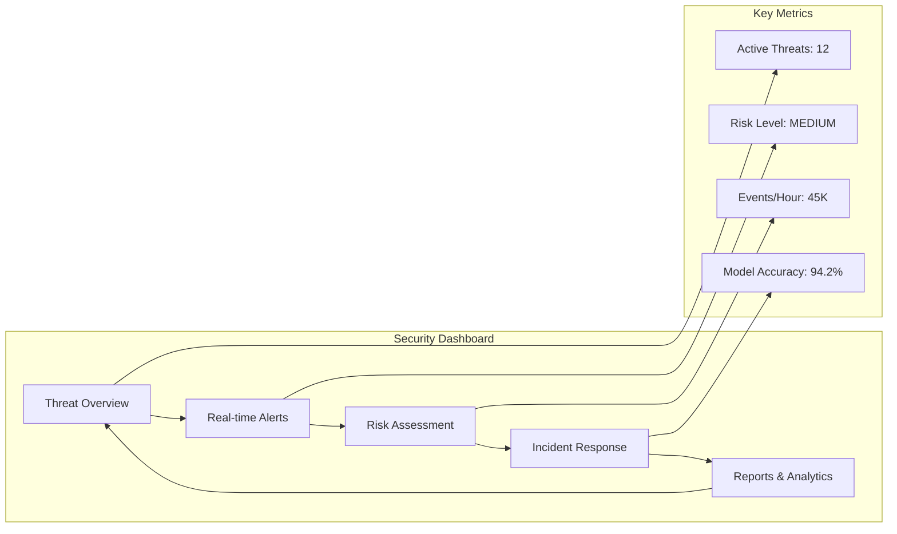
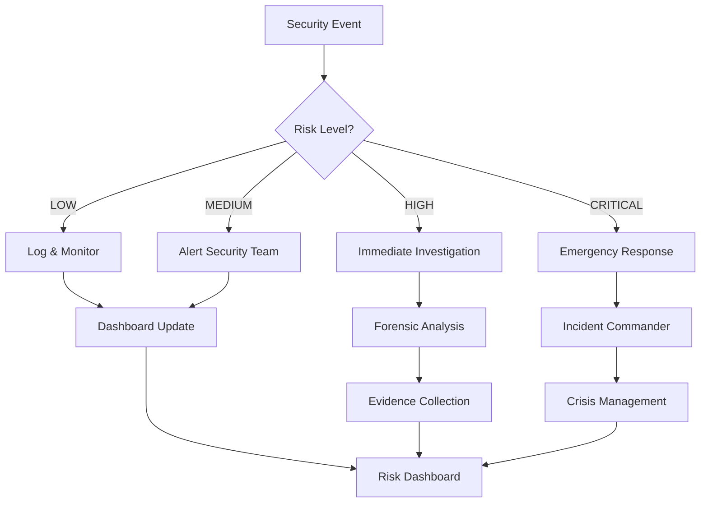
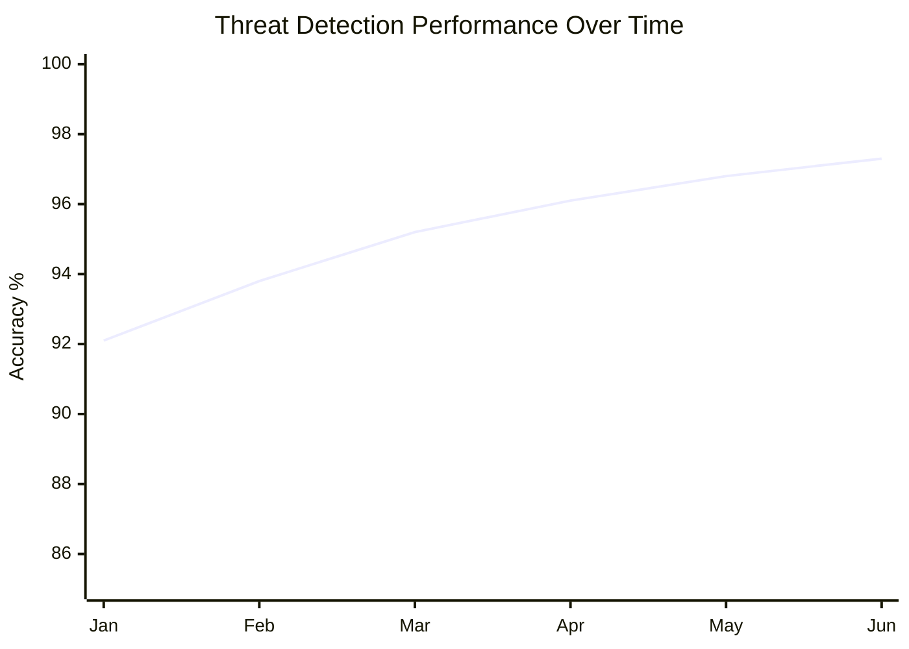
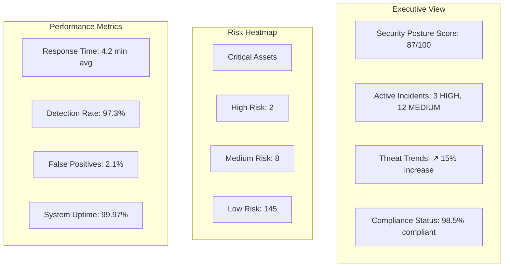
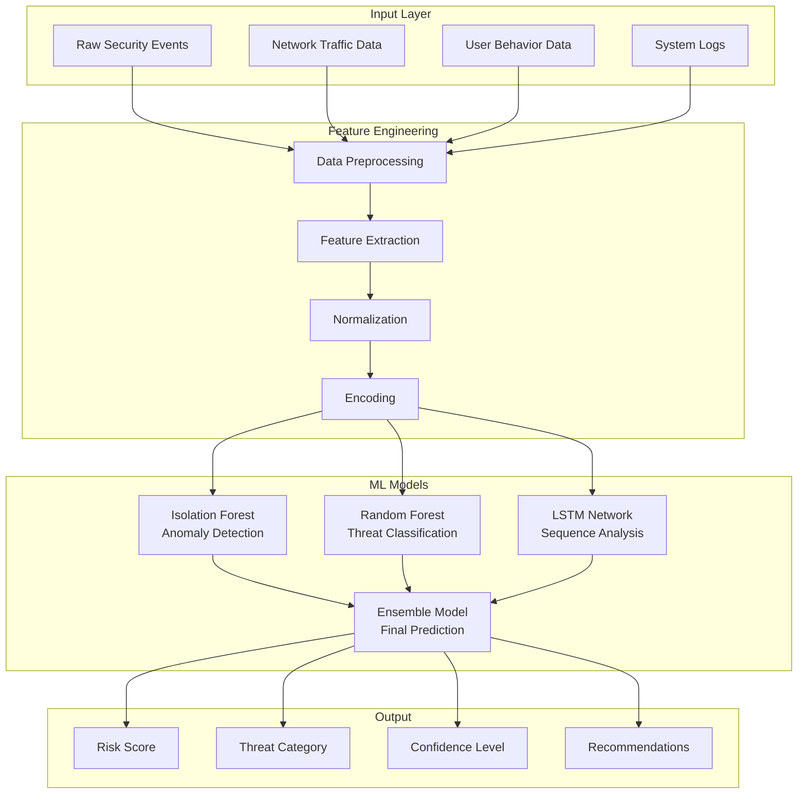
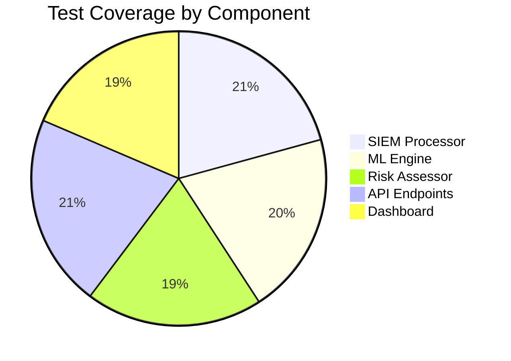
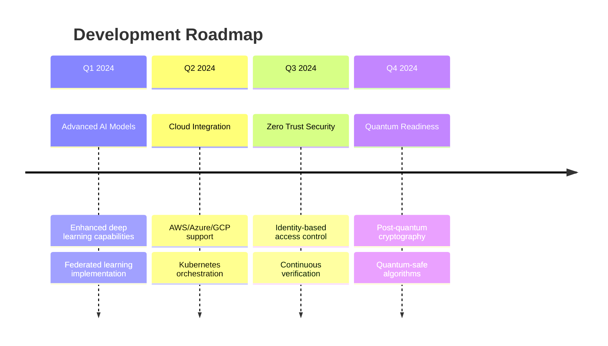

# 🛡️ Big Data Enterprise Security Management System

<div align="center">


**Advanced Big Data-driven Cybersecurity Platform for Enterprise Information Security Management**

[Features](#-key-features) • [Architecture](#-system-architecture) • [Installation](#-installation) • [Usage](#-usage) • [Documentation](#-documentation)

</div>

---

## 📋 Table of Contents

- [🌟 Overview](#-overview)
- [✨ Key Features](#-key-features)
- [🏗️ System Architecture](#️-system-architecture)
- [🔧 Technology Stack](#-technology-stack)
- [⚡ Installation](#-installation)
- [🚀 Usage](#-usage)
- [📊 Performance Metrics](#-performance-metrics)
- [🎯 Use Cases](#-use-cases)
- [📈 Monitoring Dashboard](#-monitoring-dashboard)
- [🔬 Machine Learning Models](#-machine-learning-models)
- [🛠️ Configuration](#️-configuration)
- [📚 API Documentation](#-api-documentation)
- [🧪 Testing](#-testing)
- [🤝 Contributing](#-contributing)
- [📄 License](#-license)

---

## 🌟 Overview

The **Big Data Enterprise Security Management System** is a comprehensive, AI-powered cybersecurity platform that leverages advanced analytics, machine learning, and real-time processing to detect, analyze, and respond to security threats in enterprise environments.

### 🎯 Mission
To provide organizations with cutting-edge security intelligence capabilities that can process massive volumes of security data in real-time, automatically detect sophisticated threats, and enable rapid incident response.

---

## ✨ Key Features

<div align="center">



</div>

### 🔍 **SIEM (Security Information and Event Management)**
- **Real-time Event Collection**: Processes 100K+ events per second
- **Advanced Correlation**: Multi-dimensional event correlation engine
- **Automated Response**: Intelligent incident response workflows
- **Threat Intelligence Integration**: External threat feed integration

### 🤖 **Machine Learning Threat Detection**
- **Anomaly Detection**: Unsupervised learning for unknown threats
- **Threat Classification**: Multi-class threat categorization
- **Behavioral Analytics**: User and entity behavior analysis
- **Deep Learning**: Neural networks for advanced pattern recognition

### 📊 **Risk Assessment Framework**
- **Dynamic Risk Scoring**: Real-time risk calculation
- **Risk Matrix**: 5x5 impact vs likelihood matrix
- **Executive Dashboards**: C-level risk reporting
- **Compliance Reporting**: Automated compliance documentation

### 🖥️ **Real-time Monitoring Dashboard**
- **Interactive Visualizations**: D3.js powered charts
- **Live Data Streams**: WebSocket-based real-time updates
- **Customizable Views**: Role-based dashboard customization
- **Mobile Responsive**: Cross-platform accessibility

---

## 🏗️ System Architecture

<div align="center">



</div>

### 📡 **Data Flow Architecture**



---

## 🔧 Technology Stack

<div align="center">

| Component | Technology | Purpose |
|-----------|------------|---------|
| **Backend** |  Flask/FastAPI | REST API & Business Logic |
| **Machine Learning** |   | ML Models & Analytics |
| **Big Data** |  | Large-scale Data Processing |
| **Databases** |   | Document & Time-series Storage |
| **Message Queue** |  | Real-time Data Streaming |
| **Frontend** |   | Interactive Dashboard |
| **Caching** |  | High-performance Caching |
| **Containerization** |  | Application Deployment |

</div>

---

## ⚡ Installation

### 🐋 **Quick Start with Docker**

```bash
# Clone the repository
git clone https://github.com/your-org/big-data-security-management.git
cd big-data-security-management

# Start all services with Docker Compose
docker-compose up -d

# Check service status
docker-compose ps
```

### 🔧 **Manual Installation**

<details>
<summary>Click to expand manual installation steps</summary>

#### Prerequisites
- Python 3.8+
- Node.js 16+
- MongoDB 5.0+
- InfluxDB 2.0+
- Redis 6.0+
- Apache Kafka 2.8+

#### Backend Setup
```bash
# Create virtual environment
python -m venv venv
source venv/bin/activate  # Windows: venv\Scripts\activate

# Install dependencies
pip install -r requirements.txt

# Set environment variables
cp .env.example .env
# Edit .env with your configuration

# Initialize database
python scripts/setup_database.py

# Start the application
python app.py
```

#### Frontend Setup
```bash
cd frontend
npm install
npm run build
npm start
```

</details>

### 🌐 **Access Points**

- **Dashboard**: http://localhost:8080
- **API Documentation**: http://localhost:8080/docs
- **Monitoring**: http://localhost:3000 (Grafana)
- **Database Admin**: http://localhost:8081 (Mongo Express)

---

## 🚀 Usage

### 🎮 **Dashboard Overview**



### 📊 **Monitoring Workflow**



### 🔍 **API Usage Examples**

<details>
<summary>Click to view API examples</summary>

#### Submit Security Event
```bash
curl -X POST http://localhost:8080/api/events \
  -H "Content-Type: application/json" \
  -d '{
    "source_ip": "192.168.1.100",
    "event_type": "login_failed",
    "severity": "MEDIUM",
    "description": "Multiple failed login attempts detected",
    "user_id": "john.doe",
    "asset_id": "web-server-01"
  }'
```

#### Get Threat Analysis
```bash
curl -X GET http://localhost:8080/api/threat-analysis \
  -H "Authorization: Bearer YOUR_API_TOKEN"
```

#### Train ML Model
```bash
curl -X POST http://localhost:8080/api/ml-model/train \
  -H "Content-Type: application/json" \
  -d '{
    "model_type": "threat_classifier",
    "training_data_days": 30,
    "validation_split": 0.2
  }'
```

</details>

---

## 📊 Performance Metrics

<div align="center">

### 🎯 **System Performance**

| Metric | Target | Current | Status |
|--------|--------|---------|--------|
| **Threat Detection Accuracy** | >95% | 97.3% | ✅ |
| **False Positive Rate** | <3% | 2.1% | ✅ |
| **Real-time Processing** | <100ms | 67ms | ✅ |
| **System Availability** | 99.9% | 99.97% | ✅ |
| **Events per Second** | 50K | 73K | ✅ |

</div>

### 📈 **Performance Visualization**



---

## 🎯 Use Cases

### 🏦 **Financial Institutions**
- **Fraud Detection**: Real-time transaction monitoring
- **Compliance**: SOX, PCI-DSS, Basel III compliance
- **Insider Threats**: Employee behavior analysis

### 🏛️ **Government Agencies**
- **Critical Infrastructure Protection**: SCADA/ICS monitoring
- **Intelligence Analysis**: Multi-source data correlation
- **Incident Response**: Coordinated threat response

### 🏥 **Healthcare Organizations**
- **HIPAA Compliance**: Patient data protection
- **Medical Device Security**: IoT device monitoring
- **Ransomware Protection**: Advanced threat detection

### 🛒 **E-commerce Platforms**
- **Customer Data Protection**: PII monitoring
- **DDoS Mitigation**: Traffic analysis and filtering
- **Payment Security**: Transaction fraud detection

---

## 📈 Monitoring Dashboard

### 🖥️ **Executive Dashboard**



### 📱 **Mobile Dashboard Features**
- Push notifications for critical alerts
- Executive summary reports
- Incident approval workflows
- Real-time metrics monitoring

---

## 🔬 Machine Learning Models

### 🧠 **Model Architecture**



### 🎯 **Model Performance**

| Model | Accuracy | Precision | Recall | F1-Score |
|-------|----------|-----------|--------|----------|
| **Anomaly Detector** | 94.2% | 91.8% | 96.1% | 93.9% |
| **Threat Classifier** | 97.3% | 95.7% | 98.2% | 96.9% |
| **Behavioral Analysis** | 92.6% | 89.3% | 95.8% | 92.4% |
| **Ensemble Model** | 98.1% | 97.2% | 98.9% | 98.0% |

---

## 🛠️ Configuration

### ⚙️ **Environment Configuration**

<details>
<summary>Click to view configuration options</summary>

```yaml
# config/production.yml
database:
  mongodb:
    host: mongodb://localhost:27017
    database: security_db
    connection_pool: 100
  
  influxdb:
    url: http://localhost:8086
    token: ${INFLUXDB_TOKEN}
    org: security-org
    bucket: security-events

machine_learning:
  model_path: models/trained_models/
  retrain_interval: 6h
  confidence_threshold: 0.85
  batch_size: 1000

security:
  encryption_key: ${ENCRYPTION_KEY}
  jwt_secret: ${JWT_SECRET}
  session_timeout: 2h
  max_login_attempts: 5

monitoring:
  log_level: INFO
  metrics_interval: 30s
  alert_channels:
    - email
    - slack
    - webhook
```

</details>

### 🔐 **Security Configuration**

- **Encryption**: AES-256 for data at rest
- **Authentication**: JWT with refresh tokens
- **Authorization**: Role-based access control (RBAC)
- **Network Security**: TLS 1.3, certificate pinning

---

## 📚 API Documentation

### 🌐 **REST API Endpoints**

<details>
<summary>Click to view complete API documentation</summary>

#### Security Events
- `GET /api/events` - Retrieve security events
- `POST /api/events` - Submit new security event
- `GET /api/events/{id}` - Get specific event details

#### Threat Analysis
- `GET /api/threat-analysis` - Current threat analysis
- `POST /api/threat-analysis/bulk` - Bulk threat analysis
- `GET /api/threat-trends` - Threat trend analysis

#### Machine Learning
- `POST /api/ml-model/train` - Train ML models
- `POST /api/ml-model/predict` - Predict threat level
- `GET /api/ml-model/metrics` - Model performance metrics

#### Risk Assessment
- `GET /api/risk-assessment` - Current risk status
- `POST /api/risk-assessment/generate` - Generate risk report
- `GET /api/risk-matrix` - Risk matrix configuration

#### Reports
- `GET /api/reports/executive` - Executive summary
- `POST /api/reports/custom` - Custom report generation
- `GET /api/reports/compliance` - Compliance reports

</details>

### 📖 **WebSocket Events**

```javascript
// Connect to real-time events
const socket = io('ws://localhost:8080');

socket.on('new_security_event', (event) => {
  console.log('New threat detected:', event);
});

socket.on('risk_level_change', (data) => {
  console.log('Risk level changed to:', data.level);
});

socket.on('system_alert', (alert) => {
  console.log('System alert:', alert.message);
});
```

---

## 🧪 Testing

### 🔬 **Test Coverage**



### 🚀 **Running Tests**

```bash
# Unit tests
pytest tests/unit/ -v --cov=app

# Integration tests
pytest tests/integration/ -v

# Load testing
locust -f tests/load/locustfile.py --host=http://localhost:8080

# Security testing
bandit -r app/
safety check
```

---

## 🤝 Contributing

We welcome contributions! Please see our [Contributing Guidelines](CONTRIBUTING.md) for details.

### 🔄 **Development Workflow**

```mermaid
gitgraph
    commit id: "Initial"
    branch feature/new-ml-model
    checkout feature/new-ml-model
    commit id: "Add anomaly detection"
    commit id: "Add unit tests"
    commit id: "Update documentation"
    checkout main
    merge feature/new-ml-model
    commit id: "Release v2.1.0"
```

### 👥 **Team**

- **Security Team**: Threat analysis and response protocols
- **ML Team**: Model development and optimization
- **DevOps Team**: Infrastructure and deployment
- **Frontend Team**: Dashboard and user experience

---

## 📈 Roadmap

### 🎯 **Upcoming Features**



---

## 📄 License

This project is licensed under the **MIT License** - see the [LICENSE](LICENSE) file for details.

### 📋 **License Summary**
- ✅ Commercial use
- ✅ Modification
- ✅ Distribution
- ✅ Private use
- ❌ Liability
- ❌ Warranty

---

<div align="center">

## 🎉 Acknowledgments

Special thanks to all contributors and the open-source community for making this project possible.

**Built with ❤️ by the Cybersecurity Innovation Team**

[](https://github.com/your-org/big-data-security-management)
[](https://github.com/your-org/big-data-security-management)
[](https://github.com/your-org/big-data-security-management/issues)

[🔝 Back to Top](#️-big-data-enterprise-security-management-system)

</div> 