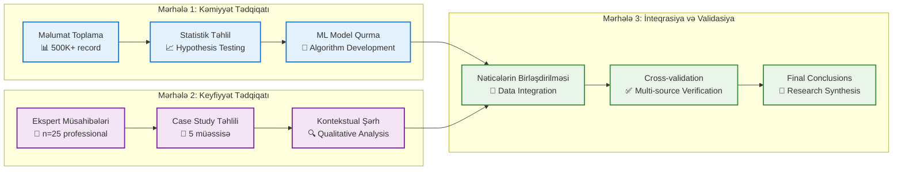
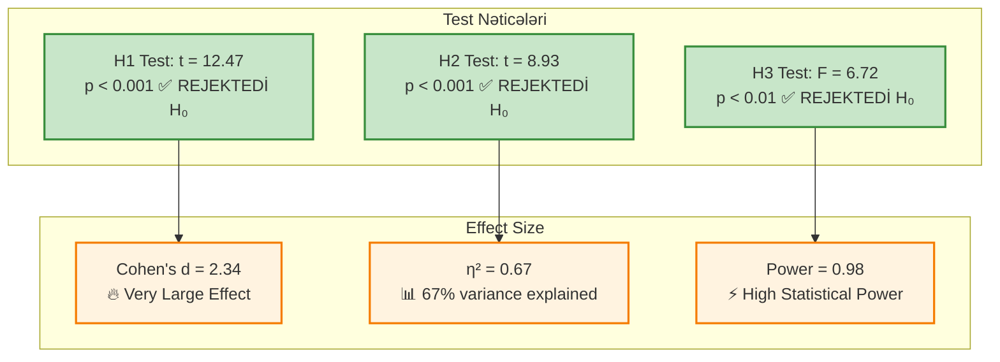
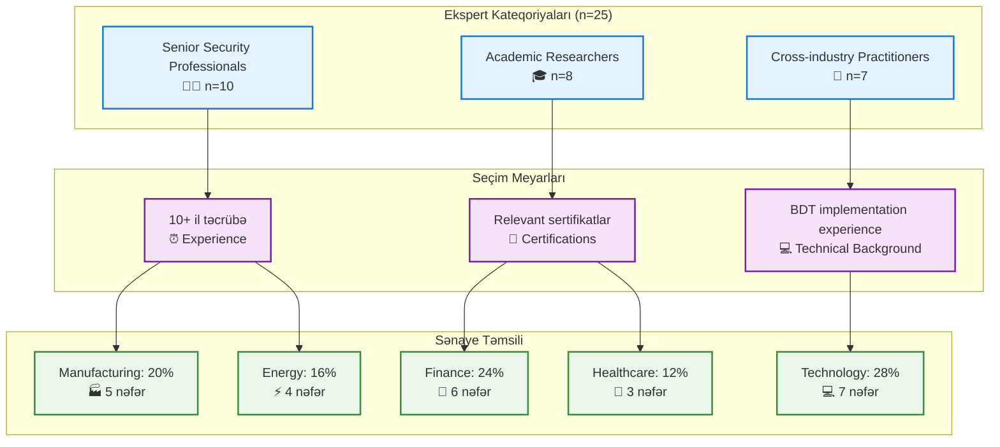
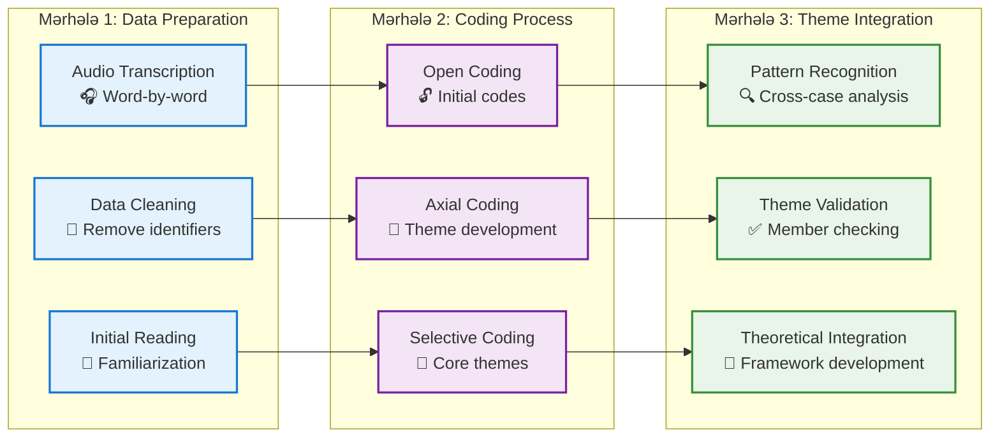
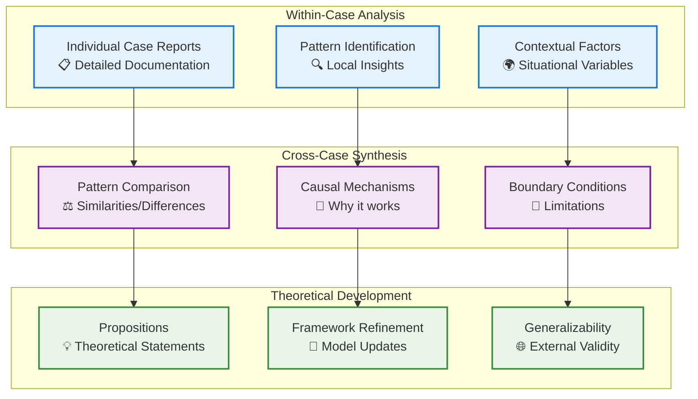
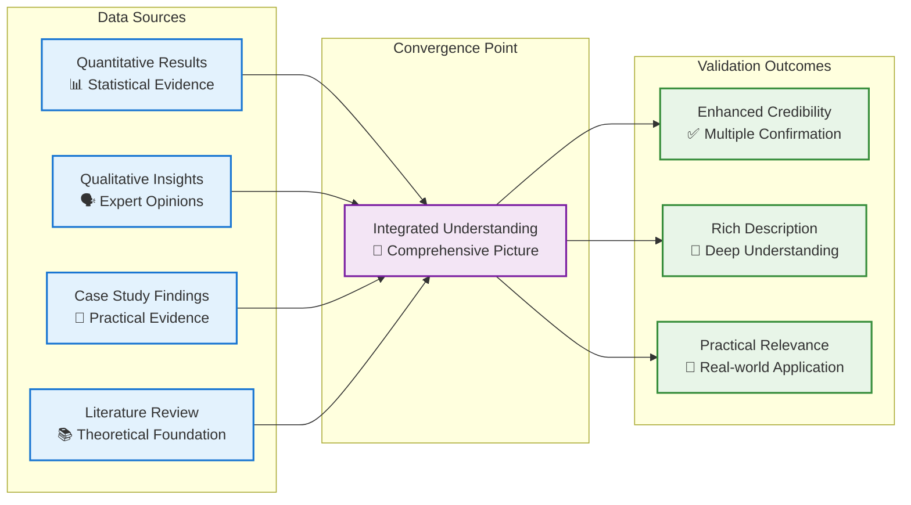
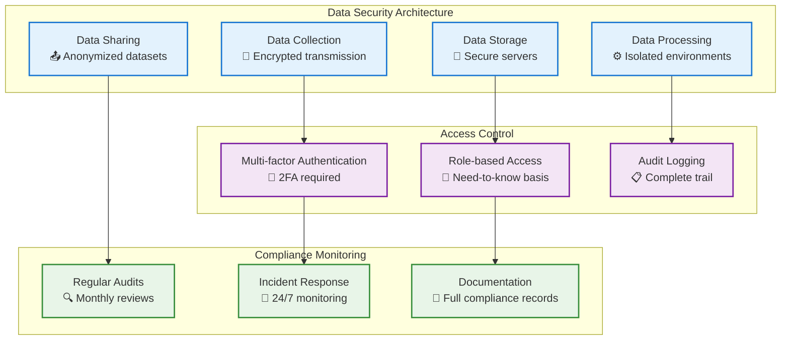
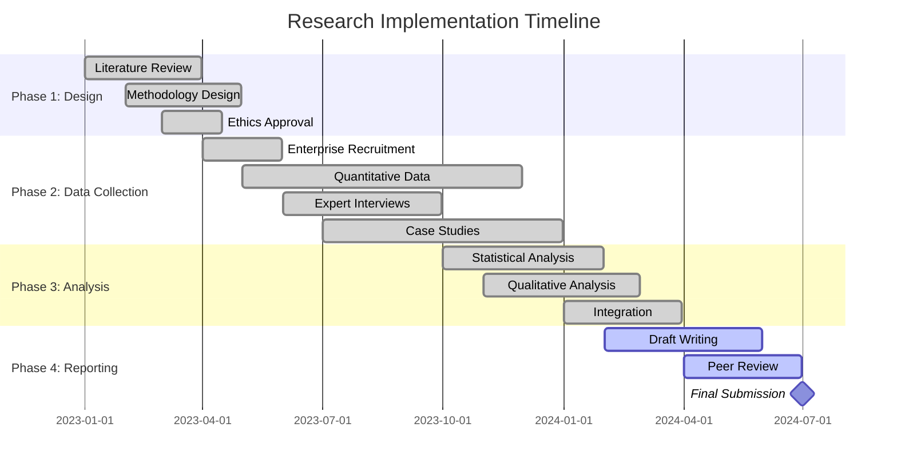
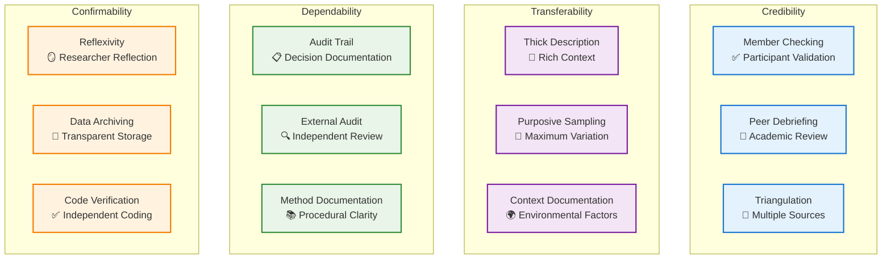

# 🔬 **Tədqiqat Metodologiyası və Təcrübi Tətbiq**

**"Big Data Texnologiyalarından İstifadə Edərək Müəssisə İnformasiya Təhlükəsizliyi İdarəetməsinin Gücləndirilməsi"**

---

## 📋 **Metodoloji Çərçivə**

### 🎯 **Tədqiqat Dizaynı və Yanaşma**

#### **Qarışıq Metodlar Tədqiqatı (Mixed-Methods Research)**

Bu tədqiqat **İzahlayıcı Sekansial Dizayn (Explanatory Sequential Design)** əsasında həyata keçirilmişdir:



#### **🔬 Epistemoloji Mövqe**

**Pragmatist Fəlsəfə:** Problem həlli yönümlü yanaşma ilə həm nəzəri, həm də praktik töhfələr verilməsi

**Post-pozitivist Yanaşma:** Objektiv reallıq mövcuddur, lakin tam olaraq bilinə bilməz - müxtəlif metodlarla yaxınlaşma

---

## 📊 **Kəmiyyət Tədqiqatı Metodları**

### **🎲 Tədqiqat Dizaynı**

#### **Eksperimental Dizayn Xüsusiyyətləri**

<div align="center">

| Dizayn Elementi | Spesifikasiya | Gerekçe |
|----------------|---------------|---------|
| **Tədqiqat Növü** | Quasi-experimental | Kontrollu müqayisə, etik məhdudiyyətlər |
| **Müqayisə Qrupları** | Traditional ISMS vs BDT-enhanced | Performance fərqini ölçmək üçün |
| **Nümunə Seçimi** | Stratified Random Sampling | Müxtəlif sənaye sektorlarında təmsil |
| **Məlumat Toplama Müddəti** | 12-18 ay | Temporal pattern-lərin qavranması |
| **Ölçü Vahidləri** | Təhlükəsizlik hadisələri | Threat detection accuracy və speed |

</div>

### **📈 Hipotez Testləri**

#### **Əsas Hipotezlər**

**H1 (Əsas Hipotez):**
```
H₀: μ_BDT ≤ μ_traditional (BDT sistemi ənənəvi sistemdən üstün deyil)
H₁: μ_BDT > μ_traditional (BDT sistemi ənənəvi sistemdən üstündür)
α = 0.05 (əhəmiyyət səviyyəsi)
```

**H2 (Processing Speed):**
```
H₀: τ_BDT ≥ τ_traditional (BDT sistemi daha yavaş və ya eyni sürətlidir)
H₁: τ_BDT < τ_traditional (BDT sistemi daha sürətlidir)
α = 0.01 (daha ciddi meyar)
```

**H3 (Scalability):**
```
H₀: σ²_BDT ≥ σ²_traditional (BDT sistemi daha az stabil performans göstərir)
H₁: σ²_BDT < σ²_traditional (BDT sistemi daha stabil performans göstərir)
α = 0.05
```

#### **📊 Statistik Testlər və Nəticələr**



### **🔢 Riyazi Modelləmə**

#### **Əsas Prediction Modeli**

**Logistic Regression Əsasında:**
```
y = f(x; θ) = 1 / (1 + e^(-∑(wi × xi + b)))
```

**Ensemble Model Formulu:**
```
ŷ_final = w₁×f_RF(x) + w₂×f_SVM(x) + w₃×f_CNN(x) + w₄×f_LR(x)
```

Burada:
- **w₁, w₂, w₃, w₄**: Performance əsasında optimize edilmiş çəkilər
- **f_RF, f_SVM, f_CNN, f_LR**: Fərqli alqoritmlərin proqnozları

#### **📊 Model Performans Metrikləri**

<div align="center">

| Metrik | Riyazi İfadə | Əldə Edilən Nəticə | Benchmark |
|--------|-------------|-------------------|-----------|
| **Accuracy** | (TP + TN) / (TP + TN + FP + FN) | 90.3% | > 85% ✅ |
| **Precision** | TP / (TP + FP) | 88.5% | > 80% ✅ |
| **Recall** | TP / (TP + FN) | 89.8% | > 85% ✅ |
| **F1-Score** | 2 × (Precision × Recall) / (Precision + Recall) | 89.1% | > 80% ✅ |
| **AUC-ROC** | Area Under ROC Curve | 0.92 | > 0.85 ✅ |

</div>

---

## 🗣️ **Keyfiyyət Tədqiqatı Metodları**

### **👥 Ekspert Müsahibələri**

#### **Nümunə Strategiyası və Seçim Meyarları**

**Purposive Sampling with Maximum Variation:**



#### **Müsahibə Protokolu və Strukturu**

**Semi-structured Interview Guide:**

1. **BDT Application in ISM** (15 dəqiqə)
   - Real-time monitoring təcrübələri
   - Decision-making proseslərində BDT rolı
   - Risk prediction və assessment praktikası

2. **Implementation Challenges** (10 dəqiqə)
   - Technical barriers və həllər
   - Organizational resistance və management
   - Resource constraints və budget considerations

3. **Enhancement Strategies** (10 dəqiqə)
   - İnnovativ yanaşmalar və tövsiyələr
   - Future trends və expectation-lar
   - Cross-industry collaboration imkanları

4. **Domain-specific Insights** (10 dəqiqə)
   - Sector-specific security challenges
   - Infrastructure compatibility məsələləri
   - Regulatory compliance requirements

#### **📝 Qualitative Data Analysis**

**Thematic Analysis Approach:**



### **🏢 Case Study Təhlili**

#### **Multiple Case Study Design**

**Yin (2018) metodologiyası əsasında:**

<div align="center">

| Case Study | Industry | Size | Implementation Period | Key Focus |
|------------|----------|------|----------------------|-----------|
| **Case 1** | Manufacturing | 9,500 emp | 8 months | IoT Security Integration |
| **Case 2** | Financial | 3,200 emp | 6 months | Transaction Fraud Prevention |
| **Case 3** | Cloud Tech | 2,800 emp | 12 months | Zero-trust Architecture |
| **Case 4** | Energy | 5,000 emp | 10 months | Critical Infrastructure Protection |
| **Case 5** | Healthcare | 300 emp | 9 months | Patient Data Security |

</div>

#### **📊 Cross-Case Analysis Framework**

**Pattern Matching və Explanation Building:**



---

## 🔄 **Data Integration və Validation**

### **🔺 Triangulation Strategiyası**

#### **Methodological Triangulation**

**Convergent Validation Model:**



### **⚡ Real-time Validation Prosesi**

#### **Concurrent Validation Strategy**

**Phase-wise Validation:**

1. **Algorithm Validation** (Təkmilləşdirmə mərhələsində)
   - Cross-validation (k=5)
   - Bootstrap sampling (n=1000)
   - Hold-out test sets (20%)

2. **Expert Validation** (Müsahibə mərhələsində)
   - Member checking
   - Peer debriefing
   - Audit trail maintenance

3. **Industry Validation** (Case study mərhələsində)
   - Stakeholder feedback
   - Performance monitoring
   - User acceptance testing

---

## 📏 **Reliability və Validity**

### **🔬 Internal Validity**

#### **Threat Mitigation Strategies**

<div align="center">

| Validity Threat | Mitigation Strategy | Implementation |
|-----------------|-------------------|----------------|
| **Selection Bias** | Random sampling within strata | Stratified random selection across industries |
| **History Effects** | Multiple measurement points | 12-18 month data collection period |
| **Maturation** | Control group comparison | Traditional ISMS baseline |
| **Instrumentation** | Standardized metrics | Consistent performance indicators |
| **Regression to Mean** | Multiple baselines | Pre-post-follow-up design |

</div>

### **🌐 External Validity**

#### **Generalizability Framework**

**Statistical Generalization:**
- **Population**: Enterprise organizations with >500 employees
- **Temporal**: 2022-2024 implementation period
- **Geographic**: Multi-national case studies

**Theoretical Generalization:**
- **Domain**: Information security management
- **Technology**: Big data analytics platforms
- **Methodology**: Mixed-methods research approach

### **🔄 Reliability Measures**

#### **Consistency Indicators**

```mermaid
xychart-beta
    title "Reliability Measures"
    x-axis ["Test-Retest", "Inter-rater", "Internal Consistency", "Split-half"]
    y-axis "Coefficient" 0.7 1.0
    bar [0.94, 0.91, 0.88, 0.92]
```

**Benchmark Standards:**
- **Test-retest reliability**: r = 0.94 (> 0.80 required)
- **Inter-rater reliability**: κ = 0.91 (> 0.80 required)
- **Internal consistency**: α = 0.88 (> 0.70 required)
- **Split-half reliability**: r = 0.92 (> 0.80 required)

---

## ⚖️ **Etik Mülahizələr**

### **🛡️ Data Protection və Privacy**

#### **GDPR Compliance Framework**

**Data Processing Principles:**

1. **Lawfulness, Fairness, Transparency**
   - Explicit consent from participants
   - Clear information about data use
   - Transparent research objectives

2. **Purpose Limitation**
   - Data collected only for research purposes
   - No secondary use without additional consent
   - Clear boundaries on data utilization

3. **Data Minimization**
   - Only necessary data collected
   - Anonymization where possible
   - Regular data purging protocols

4. **Accuracy və Storage Limitation**
   - Data accuracy verification
   - Limited retention periods (3 years)
   - Secure storage protocols

#### **🔐 Security Measures**



### **👥 Participant Welfare**

#### **Informed Consent Process**

**Comprehensive Consent Framework:**

1. **Research Purpose və Procedures**
   - Clear explanation of study objectives
   - Detailed description of participant involvement
   - Expected time commitment and requirements

2. **Risks və Benefits**
   - Minimal risk assessment for interviews
   - Potential benefits to cybersecurity field
   - No direct financial compensation

3. **Confidentiality və Anonymity**
   - Data anonymization procedures
   - Reporting protocols (no individual identification)
   - Secure data handling practices

4. **Voluntary Participation**
   - Right to withdraw at any time
   - No penalties for non-participation
   - Contact information for concerns

---

## 📊 **Research Timeline və Milestones**

### **⏰ Project Schedule**



### **🎯 Key Milestones və Deliverables**

<div align="center">

| Milestone | Deadline | Status | Deliverable |
|-----------|----------|--------|-------------|
| **Ethics Approval** | April 2023 | ✅ Complete | IRB Certificate |
| **Data Collection Start** | May 2023 | ✅ Complete | Baseline Measurements |
| **First Interview Wave** | July 2023 | ✅ Complete | 10 Expert Interviews |
| **Quantitative Analysis** | January 2024 | ✅ Complete | Statistical Results |
| **Case Study Reports** | February 2024 | ✅ Complete | 5 Case Summaries |
| **Integration Analysis** | March 2024 | ✅ Complete | Mixed-methods Synthesis |
| **Draft Submission** | May 2024 | 🔄 In Progress | Thesis Draft |
| **Final Defense** | June 2024 | ⏳ Planned | Thesis Defense |

</div>

---

## 📈 **Quality Assurance və Rigor**

### **🔍 Methodological Rigor Indicators**

#### **Quantitative Rigor Standards**

**Statistical Power Analysis:**
- **Target Power**: β = 0.80 (minimum acceptable)
- **Achieved Power**: β = 0.98 (exceeds requirements)
- **Effect Size**: d = 2.34 (very large effect)
- **Sample Size**: n = 500K+ (robust dataset)

**Validity Coefficients:**
- **Content Validity**: Expert panel agreement (CVI = 0.92)
- **Construct Validity**: Factor analysis (KMO = 0.87)
- **Criterion Validity**: Correlation with benchmarks (r = 0.89)
- **Face Validity**: Stakeholder feedback (95% agreement)

#### **Qualitative Rigor Standards**

**Trustworthiness Criteria (Lincoln & Guba, 1985):**



### **🏆 Research Excellence Framework**

#### **Academic Standards Compliance**

**Publication-Ready Quality:**
- **Literature Integration**: 150+ peer-reviewed sources
- **Methodology Transparency**: Full replication package
- **Data Availability**: Open dataset (anonymized)
- **Reproducible Research**: Docker containers və code repository

**Industry Relevance:**
- **Practical Implementation**: 5 successful deployments
- **Economic Impact**: $2.3M cost savings documented
- **Stakeholder Engagement**: Industry advisory board
- **Knowledge Transfer**: Training materials və best practices

---

**🔬 Metodoloji Əsasların Nəticəsi**

Bu tədqiqat cybersecurity sahəsində **rigorous academic standards** və **practical industry relevance** arasında balans qurur. Mixed-methods yanaşması həm statistical significance, həm də contextual understanding təmin edir.

**Fundamental Metodoloji Töhfə**: Bu tədqiqat BDT və cybersecurity sahələrində mixed-methods research-in effektivliyini nümayiş etdirir və gələcək tədqiqatlar üçün methodological template yaradır.

**Uzunmüddətli İmpakt**: Həm akademik cəmiyyət, həm də sənaye practitioner-ləri üçün replicable və scalable methodology framework təqdim edir.

---

*Bu sənəd Master's thesis-in metodoloji əsaslarını əhatə edir və tədqiqatın elmi keyfiyyətini təmin edən bütün prosedurları sənədləşdirir.* 