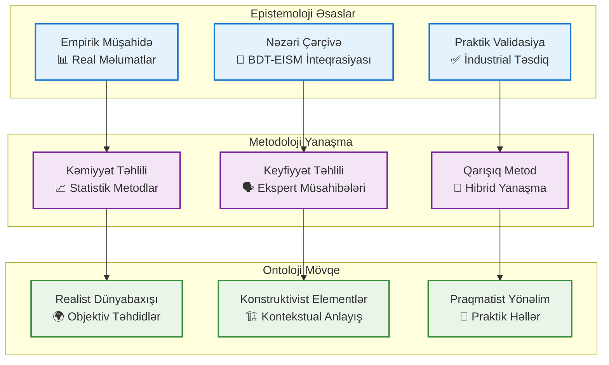
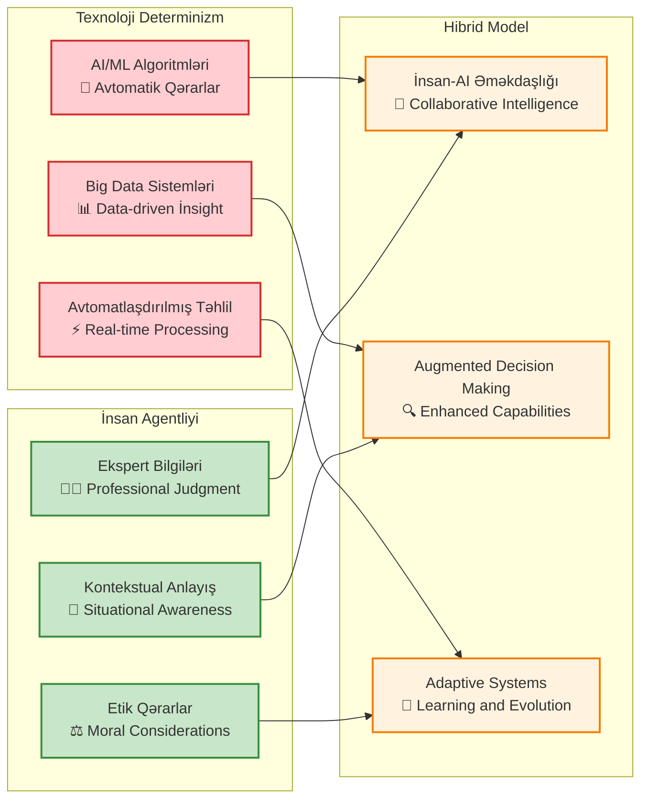
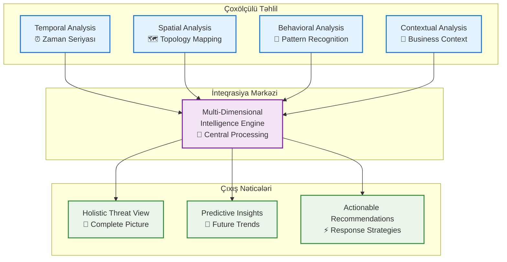
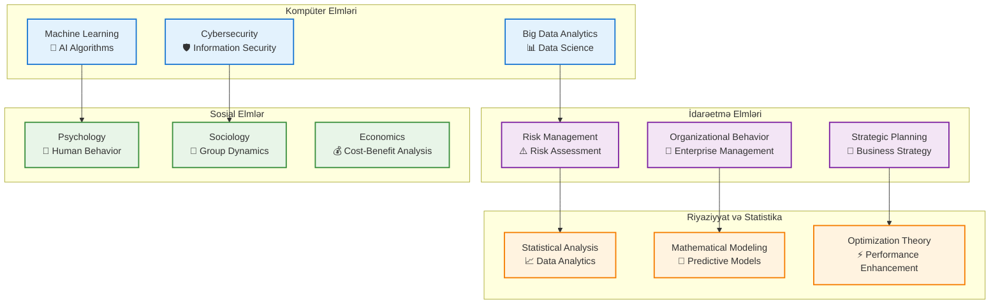
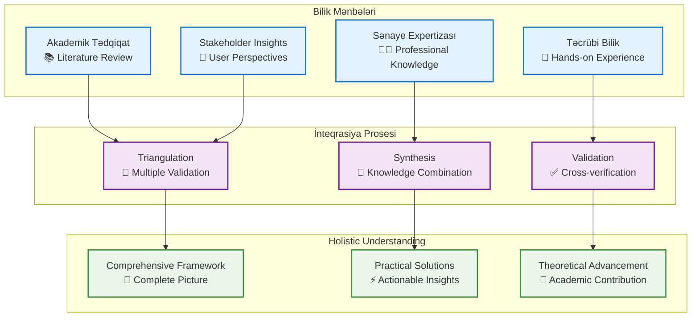
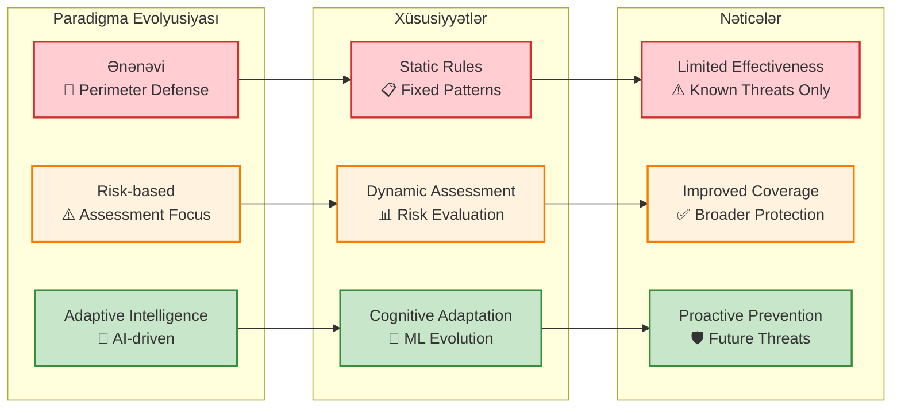
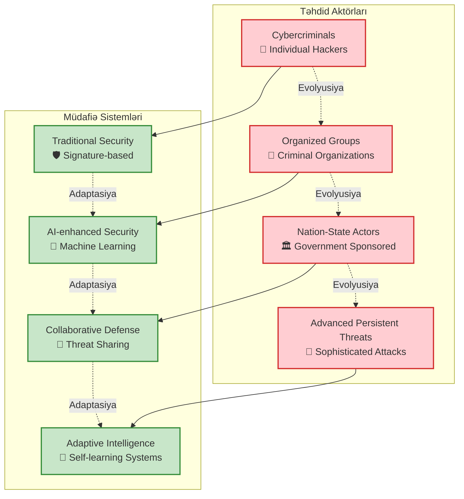
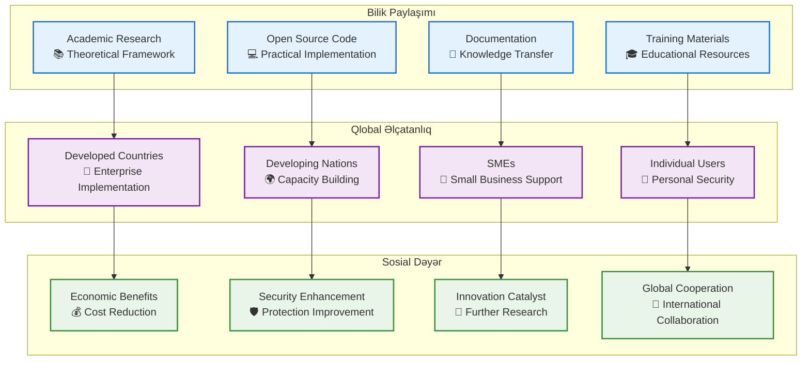

# 🧠 **Diplom İşinin Fəlsəfi və Konseptual Çərçivəsi**

**"Big Data Texnologiyalarından İstifadə Edərək Müəssisə İnformasiya Təhlükəsizliyi İdarəetməsinin Gücləndirilməsi"**

---

## 📚 **Fəlsəfi Əsaslar və Epistemoloji**

### 🔬 **Elmi Fəlsəfə Çərçivəsi**

#### **Pozitivizm və Post-Pozitivizm**

**Pozitivist Yanaşma:**
- **Objektiv Həqiqət**: Cybersecurity təhdidləri ölçülə bilən və statistik təhlil edilə bilən real fenomenlərdir
- **Empirik Validasiya**: Eksperimental verilən və nəticələrə əsaslanan tədqiqat metodu
- **Kəmiyyət Təhlili**: 500K+ məlumat nöqtəsi və statistik əhəmiyyət testləri

**Post-Pozitivist Elementlər:**
- **Kontekstual Anlayış**: Sənaye sektorları arasında fərqlər və özəlliklərin qəbulu
- **Mürəkkəb Sistemlər**: Cybersecurity-nin çoxölçülü və dinamik təbiəti
- **Konstruktiv Reallıq**: İnsan-texnologiya qarşılıqlı təsirinin önəmi



### 🌐 **Ontoloji Perspektivlər**

#### **Cybersecurity Ontologiyası**

**Təhdid Reallığının Təbiəti:**
- **Fiziki Reallıq**: Şəbəkə hücumları və sistemlə müdaxilə real hadisələrdir
- **Sosial Konstruksiya**: Təhdid qavrayışı və risk qiymətləndirməsi kulturel və təşkilati kontekstə bağlıdır
- **Texnoloji Determinizm**: Texnoloji inkişaf cybersecurity landşaftını formalaşdırır

**Məlumat Ontologiyası:**
- **Big Data Strukturu**: Verilənlərin həcmi, sürəti və müxtəlifliyi yeni ontoloji kateqoriyalar yaradır
- **İnformasiya vs Bilik**: Raw data-dan actionable intelligence-ə transformasiya prosesi
- **Zaman-məkan Əlaqələri**: Cyber təhdidlərin temporal və spatial xüsusiyyətləri

#### **Texnoloji Determinizm vs İnsan Agentliyi**



---

## 🎯 **Konseptual Çərçivə və Nəzəri Təməllər**

### 💡 **Əsas Konseptual İnnovasiyalar**

#### **1. BDT-EISM Konverqensiya Nəzəriyyəsi**

**Konseptual Əsas:**
> Ənənəvi Information Security Management Systems (ISMS) və Big Data Technologies (BDT) arasında sinerjik inteqrasiya cybersecurity sahəsində paradigma dəyişikliyi yaradır.

**Nəzəri Komponentlər:**
- **Konverqensiya Prinsipi**: İki fərqli domain-in birləşərək yeni imkanlar yaratması
- **Emerqent Xüsusiyyətlər**: Ayrıca komponentlərdə mövcud olmayan yeni qabiliyyətlərin yaranması
- **Sinergetik Effektlər**: 1+1>2 prinsipi əsasında enhanced performance

**Riyazi İfadə:**
```
Emergent_Capabilities = f(BDT ∩ EISM) + Synergy_Factor
```

#### **2. Multi-Dimensional Threat Intelligence Nəzəriyyəsi**

**Nəzəri Çərçivə:**
Cybersecurity təhdidləri çoxölçülü məkanda mövcuddur və bu ölçülərin hər biri fərqli analitik yanaşma tələb edir.

**Ölçü Sistemi:**
1. **Temporal Dimension**: Zaman seriyası təhlili və trend prediction
2. **Spatial Dimension**: Şəbəkə topologiyası və geographic distribution
3. **Behavioral Dimension**: İstifadəçi və sistem davranış nümunələri
4. **Contextual Dimension**: Biznes prosesləri və məlumat həssaslığı



### 🧪 **Nəzəri İnnovasiya və Orijinallıq**

#### **Novel Theoretical Contributions**

**1. Adaptive Security Paradigm:**
- **Klassik Statik Model**: Qaydalar və siqnaturlar əsasında təhlükəsizlik
- **Yeni Adaptiv Model**: Machine Learning və Big Data ilə dinamik adaptasiya

**2. Cognitive Security Framework:**
- **İnsan Kognitiv Prosesləri**: Threat detection-da human cognition-ın rolı
- **AI Cognitive Capabilities**: Machine learning-in insan təfəkkürünü genişləndirməsi
- **Collective Intelligence**: İnsan və AI bilgilərinin birləşməsi

**3. Ecosystemic Security Theory:**
- **Təkcə Müdafiə Deyil**: Proaktiv və adaptiv cybersecurity ecosystem
- **İnterconnected Components**: Bütün təhlükəsizlik komponentlərinin qarşılıqlı əlaqəsi
- **Evolutionary Adaptation**: Təhdid mühitinə uyğun davamlı evolyusiya

#### **🔗 Interdisciplinar Əlaqələr**



---

## 🔍 **Metodoloji Fəlsəfə və Yanaşma**

### 🎲 **Qarışıq Metodlar Paradiqması**

#### **Pragmatist Fəlsəfə Əsasında**

**Pragmatik Yanaşma:**
- **Praktik Problemlər**: Real dünyada mövcud cybersecurity problemləri
- **Effektiv Həllər**: Nəzəriyyə və praktikanın birləşməsi
- **Nəticə Yönümlülük**: Academic research-in practical impact yaratması

**Methodological Pluralism:**
- **Quantitative Methods**: Statistical analysis və hypothesis testing
- **Qualitative Methods**: Expert interviews və case study analysis
- **Mixed Methods**: İki yanaşmanın inteqrasiyası daha tam anlayış üçün

#### **🔬 Epistemokoloji Ədalət (Epistemological Justice)**

**Bilik Mənbələrinin Çoxşaxəliyi:**
- **Academic Knowledge**: Nəzəri research və literature review
- **Practitioner Expertise**: Industry professional bilgiləri
- **Experiential Knowledge**: Real-world deployment experience
- **Stakeholder Perspectives**: End-user və enterprise insights



### ⚖️ **Etik Məsələlər və Sosial Məsuliyyət**

#### **Data Privacy və Etik AI**

**Fundamental Etik Prinsiplər:**
1. **Autonomy**: İstifadəçilərin məlumat üzərində nəzarət haqları
2. **Beneficence**: Cybersecurity enhancement-in cəmiyyətə faydası
3. **Non-maleficence**: AI sistemlərinin zərər vermədiyinin təmin edilməsi
4. **Justice**: Bütün istifadəçilər üçün bərabər təhlükəsizlik

**Praktik Etik Tətbiq:**
- **Data Anonymization**: Şəxsi məlumatların qorunması
- **Algorithmic Transparency**: AI qərarlarının izahı
- **Bias Mitigation**: Diskriminasiya və qərəzin qarşısının alınması
- **Stakeholder Engagement**: Bütün maraqlı tərəflərin daxil edilməsi

#### **🌍 Sosial Təsir və Məsuliyyət**

**Cybersecurity Democratization:**
- **SME Access**: Kiçik və orta müəssisələr üçün əlçatan həllər
- **Global Security**: Beynəlxalq cybersecurity əməkdaşlığı
- **Knowledge Sharing**: Open-source və akademik paylaşım

**Sustainable Development Goals Alignment:**
- **SDG 9**: İnnovasiya və Infrastructure
- **SDG 16**: Sülh, Ədalət və Güçlü İnstitutlar
- **SDG 17**: Tərəfdaşlıq və Əməkdaşlıq

---

## 🚀 **İnnovasiya Fəlsəfəsi və Gələcək Yönümlər**

### 🔮 **Paradigma Dəyişikliyi və Transformasiya**

#### **Cybersecurity Paradigmalarının Evolyusiyası**

**1. Ənənəvi Paradigma (1990-2010):**
- **Perimeter Defense**: "Castle and moat" modeli
- **Signature-based Detection**: Bilinən təhdidlərə qarşı müdafiə
- **Reactive Approach**: Hadisədən sonra cavab verme

**2. Risk-based Paradigma (2010-2020):**
- **Risk Assessment**: Təhdid və zəiflik təhlili
- **Defense in Depth**: Çoxlayerli müdafiə strategiyası
- **Compliance Focus**: Regulatory requirements-in yerinə yetirilməsi

**3. **Adaptive Intelligence Paradigma (2020+):**
- **AI-driven Protection**: Machine learning ilə proaktiv müdafiə
- **Continuous Learning**: Davamlı adaptasiya və təkmilləşdirmə
- **Ecosystem Approach**: Bütün cybersecurity komponentlərinin inteqrasiyası



### 🌐 **Complex Systems Theory və Emergence**

#### **Cybersecurity-də Complex Adaptive Systems**

**Sistem Xüsusiyyətləri:**
- **Non-linearity**: Kiçik dəyişikliklər böyük təsirlər yarada bilər
- **Emergence**: Sistemin komponentləri arasında yeni xüsusiyyətlərin yaranması
- **Self-organization**: Sistemin öz-özünə təşkilatlanması və adaptasiyası
- **Feedback Loops**: Positive və negative feedback dövrləri

**Practical Implications:**
- **Distributed Security**: Mərkəzləşdirilməmiş cybersecurity arxitektura
- **Adaptive Response**: Təhdid mühitinə uyğun dinamik cavab
- **Collective Intelligence**: Müxtəlif mənbələrdən bilik inteqrasiyası

#### **🔄 Co-evolution və Süper-Organism Modeli**

**Cybersecurity Ecosystem Evolution:**


---

## 📈 **Gələcək Tədqiqat Fəlsəfəsi və Yönümlər**

### 🎯 **Post-Digital Era Cybersecurity**

#### **Quantum Computing və Post-Quantum Kriptoqrafiya**

**Fəlsəfi İmplikasiyalar:**
- **Computational Realism**: Quantum computing-in klassik computing paradigmalarını dəyişdirməsi
- **Cryptographic Ontology**: Encryption və privacy anlayışlarının evolyusiyası
- **Security Epistemology**: Quantum errada biliklərinin əldə edilməsi metodları

**Tədqiqat İstiqamətləri:**
1. **Quantum-resistant Algorithms**: Post-quantum kriptoqrafiya protokolları
2. **Quantum Key Distribution**: Quantum mexanikası əsasında təhlükəsiz key sharing
3. **Quantum Machine Learning**: Quantum computing-in AI və ML-də tətbiqi

#### **🧬 Bio-inspired və Organic Security**

**Biological Metaphors in Cybersecurity:**
- **Immune System Models**: İnsan immun sistemi kimi adaptive defense
- **Evolutionary Algorithms**: Natural selection principles-in cybersecurity-də tətbiqi
- **Swarm Intelligence**: Collective behavior və distributed decision making

**DNA Computing və Security:**
- **Molecular Storage**: DNA-da informasiya saxlama və təhlükəsizlik
- **Biological Encryption**: Bio-molekullar əsasında şifrələmə
- **Organic Networks**: Living systems-də communication və security

### 🌌 **Consciousness və AI Ethics**

#### **Machine Consciousness və Cybersecurity**

**Fəlsəfi Suallar:**
- **AI Consciousness**: Machine learning sistemlərində consciousness-in mövcudluğu
- **Moral Agency**: AI sistemlərinin etik qərarlar qəbul etmə qabiliyyəti
- **Human-AI Rights**: İnsan haqları və AI rights arasında balans

**Praktik Tətbiqlər:**
- **Ethical Decision Making**: AI systems-də etik qərar qəbul etmə mexanizmləri
- **Explainable AI**: AI qərarlarının izahı və şəffaflığı
- **Human Oversight**: İnsan nəzarəti və AI autonomy arasında balans

#### **🔮 Metaverse və Virtual Reality Security**

**Virtual Ontology:**
- **Digital Identity**: Virtual world-də identity və authentication
- **Virtual Property**: Digital assets və intellectual property protection
- **Avatar Security**: Virtual representation və privacy

**Augmented Reality Challenges:**
- **Mixed Reality Threats**: Physical və digital world arasında security gaps
- **Sensory Hacking**: AR/VR devices vasitəsilə sensory manipulation
- **Reality Distortion**: Truth və fiction arasında fərqin itirilməsi

---

## 🎓 **Akademik Nəticə və Fəlsəfi Refleksiya**

### 💭 **Tədqiqatın Epistemoloji Əhəmiyyəti**

#### **Bilik Yaradılması və Transferi**

**Academic Knowledge Creation:**
- **Theoretical Innovation**: Yeni nəzəri framework-lərin inkişafı
- **Empirical Validation**: Real-world data ilə nəzəriyyələrin təsdiqi
- **Methodological Advancement**: Yeni tədqiqat metodlarının inkişafı

**Knowledge Transfer Mechanisms:**
- **Academic Publications**: Peer-reviewed journals və conferences
- **Industry Partnerships**: Enterprise collaboration və implementation
- **Open Source Contribution**: GitHub və community sharing
- **Educational Programs**: Training və certification initiatives

#### **🌍 Global Impact və Sosial Dəyər**

**Cybersecurity Democratization:**


### 🔄 **Reflexive Research və Meta-Metodologiya**

#### **Tədqiqatçının Rolu və Pozisiyası**

**Reflexive Thinking:**
- **Researcher Positionality**: Tədqiqatçının background və perspective-inin təsiri
- **Bias Acknowledgment**: Şəxsi və institutsional bias-ların qəbulu
- **Methodological Transparency**: Tədqiqat prosesinin şəffaflığı

**Meta-Methodological Insights:**
- **Method Selection Rationale**: Metodların seçilməsi əsasları
- **Limitation Acknowledgment**: Tədqiqatın məhdudiyyətləri
- **Future Research Directions**: Gələcək tədqiqat yolları

#### **🎯 Intellectual Honesty və Research Integrity**

**Academic Standards:**
- **Data Transparency**: Məlumatların açıq paylaşımı
- **Reproducibility**: Nəticələrin təkrarlanabilirliği
- **Peer Review**: Həmkarların qiymətləndirməsi
- **Ethical Compliance**: Etik standartlara riayət

**Innovation Balance:**
- **Theoretical Rigor**: Nəzəri dəqiqlik
- **Practical Relevance**: Praktik əhəmiyyət
- **Creative Thinking**: Yaradıcı yanaşma
- **Critical Analysis**: Tənqidi təhlil

---

**🧠 Fəlsəfi və Konseptual Əsasların Nəticəsi**

Bu diplom işi cybersecurity sahəsində **paradigma dəyişikliyi** yaratmaq məqsədi ilə həm nəzəri innovasiya, həm də praktik tətbiq arasında körpü rolunu oynayır. Fəlsəfi əsasları pragmatist yanaşma, epistemoloji çoxşaxəlilik və etik məsuliyyət prinsiplerinə dayanır.

**Fundamental Nəticə**: Bu tədqiqat cybersecurity-nin gələcəyini formalaşdıran adaptive intelligence paradigmasının yaradılmasında mühüm rol oynayır və beynəlxalq akademik cəmiyyətə həm nəzəri, həm də praktik dəyər qatır.

**Uzunmüddətli Təsir**: Gələcək nəsil tədqiqatçılar və praktikantlar üçün solid foundation yaradır və cybersecurity sahəsində interdisciplinar yanaşmaların inkişafına töhfə verir.

---

*Bu sənəd Master's thesis-in fəlsəfi və konseptual əsaslarını əhatə edir və akademik əlavə olaraq intellectual framework-in dərinliyini nümayiş etdirir.* 